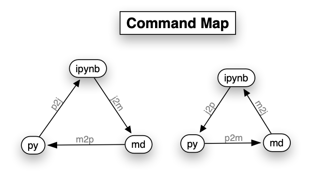
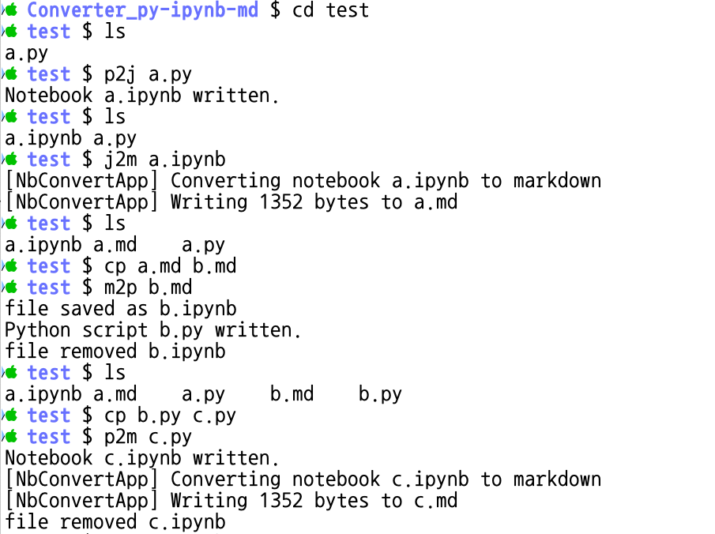
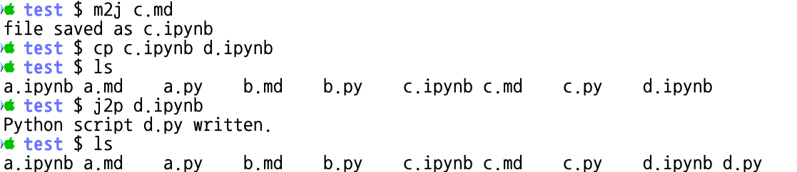
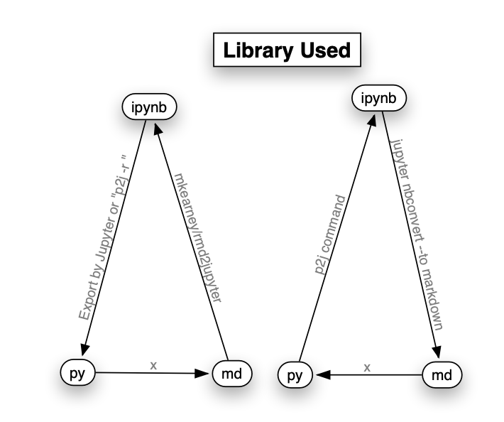

# Converter_py-ipynb-md
Converter : Python file(.py) , Jupyter Notebook file (.ipynb), Markdown file(.md)

# Install
1. R language(3.0 + )

2. R Package
```R
install.packages("devtools")
devtools::install_github("mkearney/rmd2jupyter")
#1
```
3. Python language(3.6 + )

4. Python library
```
sudo -i
curl https://bootstrap.pypa.io/get-pip.py -o /tmp/get-pip.py
python3 /tmp/get-pip.py
python3 -m pip install 'jupyter_contrib_nbextensions'
python3 -m pip install nbconvert
```

5. Install Script
```
git clone https://github.com/Finfra/Converter_py-ipynb-md.git
cd Script
. install.sh
cd ..
```

# Usage



```
cd test
ls
p2j  a.py
ls
j2m a.ipynb
ls
cp a.md b.md
m2p b.md
ls
cp b.py c.py
p2m c.py
m2j c.md
cp c.ipynb d.ipynb
ls
j2p d.ipynb
ls
```

# Cf
## Library Used


# Made by [Finfra Co., Ltd](http://finfra.com)
